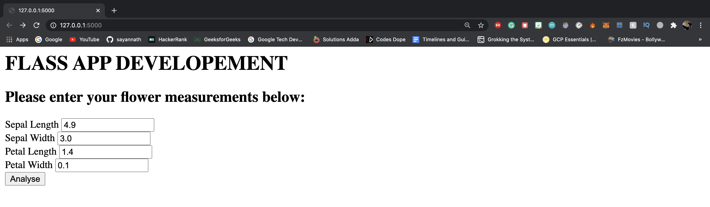
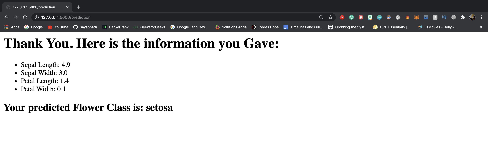
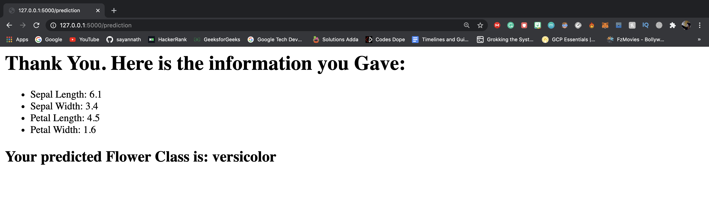

# Iris-Flower-Classification
### Iris Flower Classification deployed using Flask.

## Short Description
This web app is use to determine the different type of flower species from it's feature which are sepal length, sepal width, petal length and petal width.

### 👉 If you like this repo then please give it a ⭐️

## NOTE:
This project is subject to change by the developer and is still in development.

## Screenshots






## To test this out
Testing this is as simple as it gets. Follow this steps:
1. Clone this project.
2. Open your terminal (NOTE: git bash preferred/ Terminal on VS Code)
3. Type the following command in the terminal
     ```
     python3 my_example.py (in Mac or Linux)
     python my_example.py  (in Windows)
     ```
4. Visit the localhost to see it in action

## Pull Request

Pull Requests are welcome. Please follow these rules for the ease of understanding:
* Make sure to check for available issues before raising one
* Give me a maximum of 24-48 hours to respond
* Have proper documentation on the parts you are changing/adding


## Developed & Maintained by
[👨 Sayan Nath](https://sayan-nath.web.app/)<br>
[📷 Insta](https://www.instagram.com/sayannath235/)<br>
[🐤 Twitter](https://twitter.com/SayanNa20204009)<br>
[🧳 LinkedIn](https://www.linkedin.com/in/sayan-nath-15a989182/)
<br>

[](https://github.com/sayannath)
